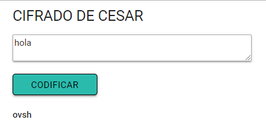

# CIFRADO DE CESAR 

### **Objetivo**
 
Al ingresar cualquier caracter alfabético de a-z ,devuelve  la cadena codificada, si se ingresa caracteres en mayúscula, lo convertirá en minuscula. 

### **Tecnologias** 
html5/css3/EMScript6

#### busqueda por tipo de comida marina

